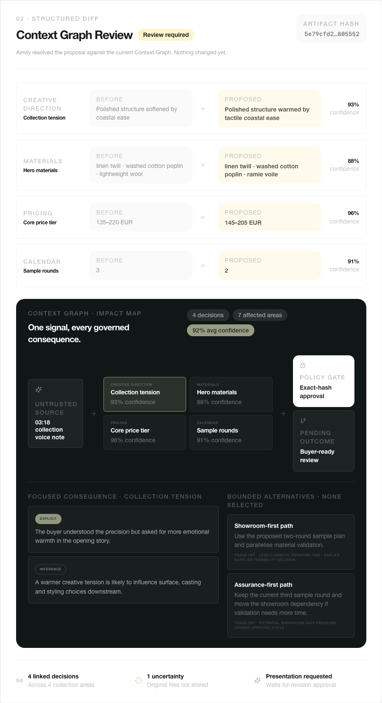
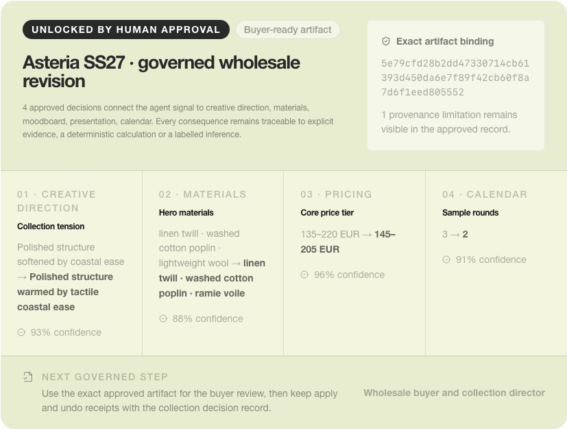

# Aimily Context Review

**OpenAI WebMCP Challenge · From agent signal to governed collection truth**

A personal agent turns a buyer meeting, fitting image, voice note or instruction into a reviewable fashion-collection revision. Aimily resolves the exact diff, maps its Context Graph, labels evidence and uncertainty, waits for human approval of the artifact hash, then exposes apply, receipt and undo at the right moments.

[Open the live demo](https://aimily-webmcp-challenge.vercel.app/webmcp-challenge) · [Watch the 75-second film](https://youtu.be/PlCmUabRF94) · [Read the submission](docs/SUBMISSION.md)



## The WebMCP idea

WebMCP is the doorway into Aimily's signed-in workspace, not a second product core and not a DOM scraper. The page registers narrow intent tools through `document.modelContext`; the server calls the same deterministic revision domain used by the interface.

```
untrusted signal
      ↓
revision artifact → Context Graph impact
      ↓
human approves exact SHA-256 hash
      ↓
approved brief → isolated apply → chained receipt → undo
```

The tool inventory changes with the governed lifecycle:

| State | Agent-visible capability |
|---|---|
| Context ready | Read context, draft revision, inspect current state |
| Draft ready | Previous reads plus inspect causal impact |
| Human approved | Approved brief and apply become available |
| Preview applied | Apply disappears and undo appears |

Approval is deliberately absent from the tool surface. The human approves the exact artifact hash in the page.

## What to try

1. Open the live demo and select the voice-note signal.
2. Draft the governed revision and inspect how one pricing decision affects margin and buyer presentation.
3. Approve the exact artifact hash with the human-only control.
4. Generate the hash-bound brief, apply only to the isolated preview, inspect the chained receipt and undo.

For a native agent run, follow [the reproducible demo](docs/DEMO.md) and [Chrome 151 evidence](docs/NATIVE-CHROME-EVIDENCE.md).



## Evidence, not claims

- 7 dynamic WebMCP tools, registered and removed page-side with abortable lifetimes.
- Native discovery and invocation proven on the public HTTPS deployment in Chrome 151.
- Native context read, governed draft, dynamic registration, readback and impact inspection independently proven in the ChatGPT in-app browser.
- 37 focused tests plus a 16-control public red team for origin, schema, tampering, replay, cross-session isolation, injection-like evidence, approval order and receipt integrity.
- `readOnlyHint` on read tools and `untrustedContentHint` on every source-bearing tool.
- Signed HttpOnly session, HMAC state, exact-hash approval and chained receipts enforced server-side.
- Seven receipt invariants are verified before each new state token is signed and exposed in structured tool results.
- No DOM reading, no screenshot interpretation and no agent-callable approval.
- Every mutation-like response says `production_data_changed: false`.
- GitHub verification installs from the lockfile, audits production dependencies, runs all 37 tests and compiles the isolated production app.

Start with the [judge scorecard](docs/JUDGE-SCORECARD.md), [verification matrix](docs/VERIFICATION.md) or [source map](docs/SOURCE-MANIFEST.md).

## Run locally

```bash
npm ci
WEBMCP_CHALLENGE_SECRET=local-only-secret npm run dev
```

Open http://localhost:3000/webmcp-challenge.

```bash
npm test
WEBMCP_CHALLENGE_SECRET=standalone-build-only-secret npm run build
```

## Safety boundary

This repository contains only the isolated Challenge surface and the shared deterministic revision domain it uses. It contains no Supabase key, production Aimily credential, billing code, commercial pricing configuration, public landing, mobile application or canonical remote MCP implementation. Apply changes only the signed Challenge preview.

## Existing product and Challenge-period work

Aimily existed before the Challenge. Its private product architecture and collection-creation domain are not being entered as newly built work. This public repository contains only the narrow shared deterministic revision subset required to prove reuse without duplicating business logic.

The Challenge-specific extension was built after submissions opened on 25 August 2026. Work began on 27 August and includes this isolated signed sandbox, the `document.modelContext` adapter, page-scoped intent tools, dynamic authority, exact-hash approval policy, receipt-chain verification, native Chrome and ChatGPT evidence, adversarial evals and the Challenge film. The public repository's initial publication commit provides a judge-visible timestamp without exposing private Aimily history.

## Publication boundary

This standalone package is generated through an explicit private allowlist. [PUBLIC_INTEGRITY.json](PUBLIC_INTEGRITY.json) records only exported paths and SHA-256 hashes; it intentionally contains no canonical repository URL, private branch, source commit or source-path map. Internal planning documents, product modules, film source and hosted media binaries are excluded. See [NOTICE.md](NOTICE.md) before using the source.

## License

Aimily Context Review is released under the [GNU Affero General Public License v3.0](LICENSE). The license applies only to this standalone Challenge repository, not to the canonical Aimily product, private repository, trademarks or excluded code.
