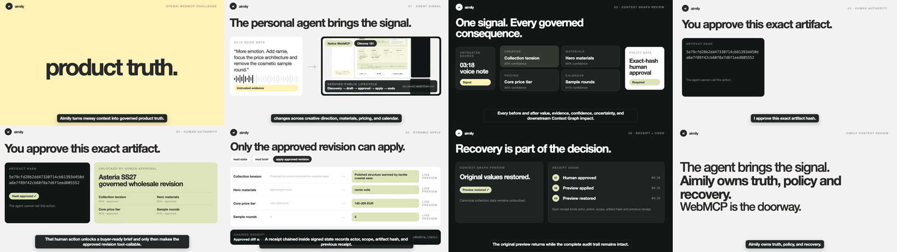
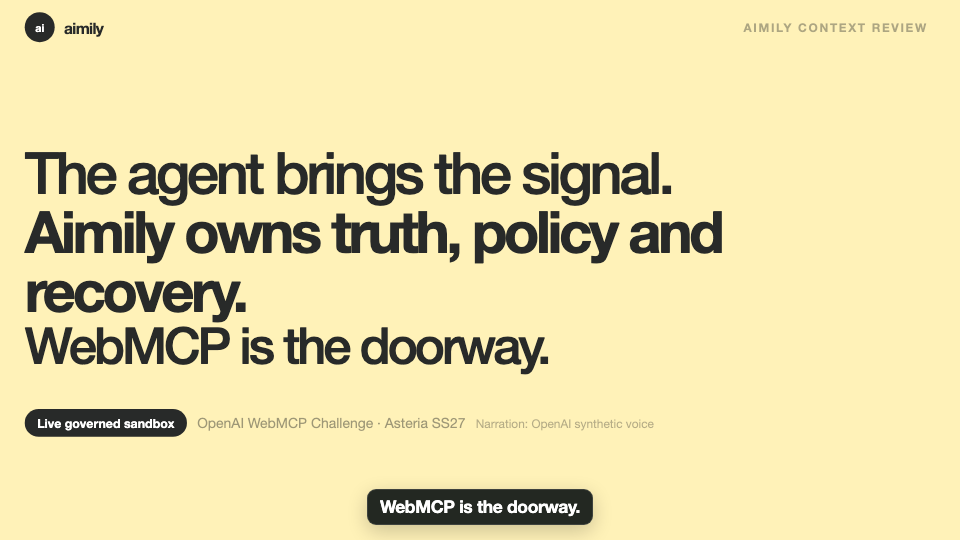

# Submission video evidence

The 75-second film turns Aimily Context Review into a judge-ready story without simulating WebMCP activity. Its agent-signal scene embeds the real Chrome 151 lifecycle captured against the public production sandbox.

## Master artifact

| Property | Verified value |
|---|---|
| Delivery | Hosted 1080p MP4 linked below |
| Duration | 75.050667 seconds |
| Video | H.264, 1920 x 1080, 30 fps |
| Audio | AAC, stereo, 48 kHz |
| Size | 30,269,103 bytes |
| SHA-256 | `de1dc37bf03ab1b86129482bb4e8db2d1a7cd4617a621a90b16e9bdc859f90c8` |

The generated master is intentionally excluded from Git. Its source composition, compact native screencast, narration manifest, final narration MP3, caption timings and render instructions are versioned.

## Public delivery encode

- URL: `https://aimily-webmcp-challenge.vercel.app/aimily-context-review.mp4`
- H.264, 1920 x 1080, 30 fps, AAC stereo at 48 kHz
- Duration: 75.050 seconds
- Size: 13,543,516 bytes
- Fast-start enabled for immediate browser playback
- SHA-256: `8989f9f96a4c7371fd1e62dbfc738f4d917e5ff44c4f7810b9f0e4015960de12`

The delivery encode preserves the mastered resolution and audio while reducing transfer size. Its eight-frame review matches the master composition and keeps all fine text and captions legible.

The deployed URL was downloaded again after the verified production deployment. It returned the same `8989f9…960de12` SHA-256, `video/mp4`, inline disposition, a 13,543,516-byte content length and valid `206 Partial Content` responses for byte ranges.

## Narration and captions

- Narration uses OpenAI `gpt-4o-mini-tts-2025-12-15` with the built-in `cedar` voice.
- The voice is generated scene by scene and fitted to the seven visual beats before loudness normalization.
- The versioned 75-second MP3 has SHA-256 `ed14c37aaad0ca011bdd164c69fa3a8fbc064cc913e5f6e25d671842dcc9d572`.
- English captions are burned into the Remotion composition using the same final script and a caption-shaped timing contract.
- The outro states `Narration: OpenAI synthetic voice` on screen.
- A machine transcription of the mastered timeline recognized the exact approval, buyer-ready brief, tool-callable revision, signed state, undo tool and `WebMCP is the doorway` close.

## Visual review

The final render was sampled across eight moments covering hook, native discovery, Context Graph, approval, apply, receipt, undo and close. No caption clipping, missing state or narrative contradiction was observed.

The final disclosure frame remains readable at delivery resolution:

## Honest remaining media boundary

The master and public delivery encode exist. A ChatGPT Desktop Site Tools insert is still an optional end-user upgrade, not a claimed proof; the current film uses the fully verified Chrome-native WebMCP capture.
